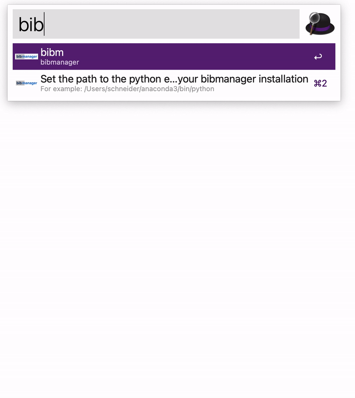
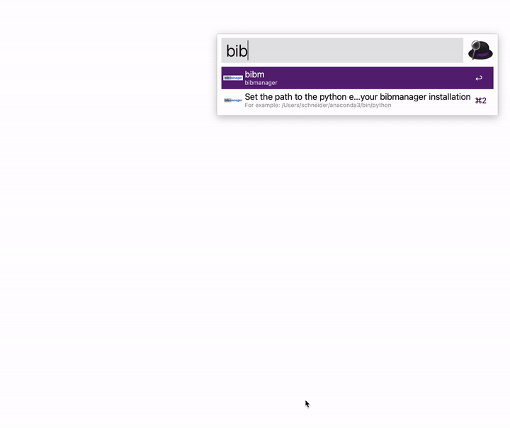

# Browse your bibmanager database using alfred!

Benefit from [bibmanager](https://bibmanager.readthedocs.io/en/latest/) and [alfred](https://bibmanager.readthedocs.io/en/latest/) to quickly access all your papers!

## Installation

1. Download the latest release from the release page:
[here](https://github.com/AaronDavidSchneider/alfred-bibmanager/releases/latest/download/alfred-bibmanager-workflow.alfredworkflow)
2. Find the path of your python installation*
3. Set PYTHON_ENV to the path of the installation

*python binary of environment containing bibmanager (e.g., `/Users/schneider/anaconda3/bin/python`). Run `which python` to find the correct path.

## Usage
- `bibm` will list your library
- select any paper and hit enter to open it

*Note: The paper will be downloaded automatically if not existent.*

## Troubleshooting
Set the `PYTHON_ENV` variable using `bibmenv`

## Credits
[@pcubillos](https://github.com/pcubillos/bibmanager) for providing [bibmanager](https://bibmanager.readthedocs.io/en/latest/)!
